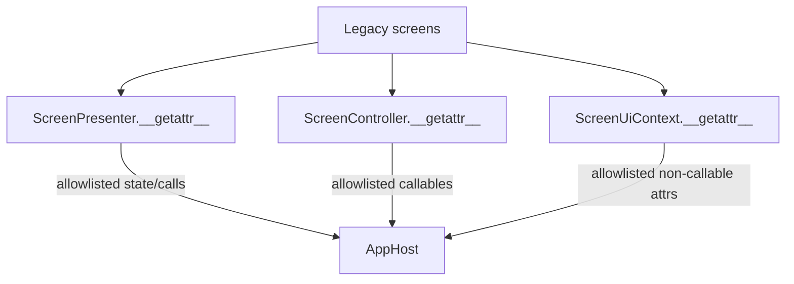

# Phase 8 Controller Fallback Convergence

Scope: structural audit only. Phase 8.4 does not migrate screens and does
not change production code. It records the remaining generic fallback
surface after the Recipe and Key Test paths were made explicit.

## Current Fallback Architecture

Definitions are in `application/adapters/device_gateway.py`.

| Fallback | Target | Allowlist style | Risk |
| --- | --- | --- | --- |
| `ScreenPresenter.__getattr__` | host-backed state, widgets, view state, selected calls | exact names plus prefixes: `axis_cal_`, `keytest_`, `validation_`, `_list`, `_refresh` | Medium. Mostly state proxying, but still host-shaped and partly callable. |
| `ScreenController.__getattr__` | host callables | exact names plus broad prefixes: `axis_cal_`, `clear_`, `compute_`, `export_`, `handle_`, `open_`, `refresh_`, `start_`, `stop_`, `write_keytest_` | High. Button commands are routed by string names into `AppHost`. |
| `ScreenUiContext.__getattr__` | host-backed non-callable UI context | exact names plus prefixes: `axis_`, `keytest_`, `validation_` | Medium-high. It exposes host state by prefix and can hide screen ownership. |

## Screen Inventory

| Screen | Current wiring | Fallback type | Concrete fallback surface |
| --- | --- | --- | --- |
| `recipe_screen.py` | `RecipeScreenPresenter` + `RecipeController` | None for generic proxies | Guarded after Phase 8.1/8.2. |
| `key_test_screen.py` | `KeyTestUiState` + `KeyTestController` | None for generic proxies | Guarded after Phase 8.3. Generic allowlist entries remain legacy-only. |
| `main_screen.py` | generic `ScreenPresenter` + generic `ScreenController` | Hybrid | State: `pipe_sn_var`, `meas_seq_var`, `auto_*`, OD/ID summary vars, `cov_var`; commands: `start_measurement`, `stop_measurement`, `clear_measurement_results`, `export_history_results`, `open_serial_template_settings`, `handle_main_result_selection`, `refresh_main_summary_panel`. |
| `axis_cal_screen.py` | generic `ScreenPresenter` + generic `ScreenController` | Hybrid | State: `axis_cal_vars`, `axis_cal_field_status_vars`, `axis_cal_status_vars`; commands: `axis_cal_read`, `axis_cal_write`, `axis_cal_capture_offsets`, `axis_cal_calibrate_b14`, `axis_cal_calibrate_keepout`, `axis_cal_set_zpos_zero`. |
| `axis_screen.py` | explicit `AxisScreenPresenter` + generic `ScreenController`/`ScreenUiContext` passed through | Mostly explicit screen presenter | The screen body calls presenter methods such as `handle_action`, `handle_jog`, `register_axis_widgets`. Remaining risk is in the presenter/controller internals, not direct generic fallback in the screen body. |
| `gauge_screen.py` | `GaugeScreenPresenter` + generic `ScreenController` | Hybrid | Commands include PLC/gauge connection, gauge reads, OD/ID calibration, validation entry points, and broad `clear_`/`compute_`/`export_` command families through presenter/controller objects. |
| `validation_screen.py` | `GaugeScreenPresenter` + generic `ScreenController` | Hybrid | State: `validation_*` vars and choices; commands: `start_validation_run`, `stop_validation_run`. |

## Fallback Categories

### 1. Command Routing Fallback

Owner: `ScreenController.__getattr__`.

This is not safe to delete today because `main_screen.py`,
`axis_cal_screen.py`, `gauge_screen.py`, and `validation_screen.py` still
route commands through the generic controller. Removal cost is Medium for
`axis_cal_screen.py`, Medium-high for `main_screen.py`, and High for
`gauge_screen.py` / `validation_screen.py`.

Replacement: explicit controller per screen or bounded screen group.

String-based routing risk: High. Prefixes such as `start_`, `stop_`,
`clear_`, `compute_`, and `axis_cal_` allow new host methods to become UI
commands without an explicit screen contract.

### 2. State Proxy Fallback

Owner: `ScreenPresenter.__getattr__` and `ScreenUiContext.__getattr__`.

This is not safe to delete today because main, axis calibration, and
validation/gauge screens still read host-backed Tk variables through
allowlisted names or prefixes. Removal cost is Medium for main and axis
calibration state, High for validation/gauge state because the state
surface is larger.

Replacement: explicit presenter deps or screen UI state dataclasses.

String-based routing risk: Medium. It is mostly state access rather than
commands, but broad prefixes keep the screen contract implicit.

### 3. Hybrid Fallback

Owners: screens using both generic state proxy and command routing.

`main_screen.py`, `axis_cal_screen.py`, `gauge_screen.py`, and
`validation_screen.py` are hybrid. These should be migrated screen by
screen. Do not delete any generic `__getattr__` while a hybrid screen is
still wired through generic proxies.

## Convergence Options

### Option 1: Recommended

Gradually remove `__getattr__` by replacing each legacy screen with:

1. an explicit controller for command methods;
2. an explicit presenter deps or UI state object for Tk variables and
   widget/view state;
3. guard tests preventing that screen from returning to dynamic fallback.

This is the preferred path because it turns hidden host coupling into
named constructor dependencies and keeps behavior stable screen by screen.

### Option 2: Conservative

Keep generic `__getattr__` temporarily, but tighten governance:

1. allow `__getattr__` only for legacy screens;
2. forbid newly migrated screens from using dynamic fallback;
3. shrink allowlists after each migration;
4. add inventory tests before removing legacy prefixes.

This should be used as the transition rule while Option 1 is underway.

## Deletion Decision

Do not delete `ScreenPresenter.__getattr__`, `ScreenController.__getattr__`,
or `ScreenUiContext.__getattr__` yet.

Deletion becomes reasonable only after all screens still wired with generic
proxies have explicit dependencies. The current code is ready for Phase 8.5
pattern consolidation, not Phase 9 fallback deletion.

## Recommended Next Screen

Next target: `axis_cal_screen.py`.

Reason: its surface is smaller and more cohesive than `main_screen.py` or
`gauge_screen.py`, and its fallback names are already grouped under
`axis_cal_*` state and command prefixes.
